# 工作区后端机制架构

> 最后更新:2026-09-26 · 由 ZCode 主会话根据 `WORKSPACE_INDEX.md` + `workspace.graph.json` + 各项目源码汇总
>
> 本文档描述当前工作区 `/Volumes/code/workspace` 的后端机制架构,以及工作区项目如何消费外部 AI 能力套件。架构图使用 mermaid 渲染。

---

## 一、4 层总览:工作区后端 + 外部能力套件

```mermaid
flowchart TB
    subgraph WB["工作区后端 · 全部位于 /Volumes/code/workspace/"]
        direction TB

        subgraph WA["第 A 层 · 治理后端<br/>foundation/workspace-governance"]
            direction TB
            WA1["workspace.json<br/>项目注册表 · 28 项"]
            WA2["workspace.graph.json<br/>42 图节点 · provider/consumer 契约"]
            WA3["workspace-project 命令行<br/>list/deps/onboard/validate/audit"]
            WA4["workspace-project-mcp<br/>14 工具 · 4 资源 · stdio JSON-RPC"]
        end

        subgraph WBP["第 B 层 · 公理个人操作系统后端<br/>foundation/axi-* · 共享 Kernel 数据模式 v7"]
            direction TB
            WB1["axi-kernel · 对象注册中心<br/>项目/文档/变更/资源/仓库/<br/>分支/提交/原始事件<br/>+ 规则/技能/代理/调用/任务/制品"]
            WB2["axi-workbench-cli<br/>扫描/修正/健康检查/关系图/基准"]
            WB3["axi-inbox<br/>收集/复核/关联/转换/归档"]
            WB4["axi-sync<br/>文件监听/变更操作/git 采集<br/>变更拆分/合并"]
            WB5["axi-runtime<br/>代理后端 · 准入闸门 · 每日反思"]
            WB6["axi-apps<br/>分享/汇总/移动服务"]
        end

        subgraph WD["第 D 层 · 业务产品后端<br/>products/ielts-vocab 示例"]
            direction TB
            WD1["gateway-bff · 网关<br/>端口 8000"]
            WD2["8 个拆分服务<br/>端口 8101-8108<br/>身份/学习/词库/AI 执行/<br/>语音/笔记/管理"]
            WD3["asr-socketio · 实时语音<br/>端口 5001"]
        end
    end

    subgraph EXT["外部人工智能能力套件 · 位于 ~/.cc-connect/<br/>工作区项目通过 graph.json provider 契约消费"]
        direction TB
        EX1["auto-router · 自动路由<br/>端口 17029"]
        EX2["ai-capability · 统一能力命令行<br/>语音/图像/OCR/大语言/嵌入<br/>生图/语音合成/视频"]
        EX3["minimax-tokenplan · MiniMax 套餐<br/>搜索/看图/生图/合成/歌词/作曲"]
        EX4["ollama-local · 本地 Ollama<br/>端口 11434"]
        EX5["cc_connect_memory · Postgres 向量库"]
        EX6["MLX Whisper · LTX-Video<br/>离线模型权重"]
    end

    subgraph X["消费方"]
        direction TB
        X1["axi-workbench 单仓"]
        X2["axi-agent 代理集群"]
        X3["axi-pet-desktop 桌面宠物"]
        X4["ielts-vocab"]
        X5["voice-assistant 语音助手"]
        X6["axi-feishu-codex-bridge 飞书桥接"]
    end

    WA1 --> WBP
    WA2 --> WBP
    WA3 --> WA4
    WA3 -.审计.-> WA1
    WA3 -.审计.-> WA2

    WB1 === WB2
    WB1 === WB3
    WB1 === WB4
    WB1 === WB5
    WB1 === WB6

    WD1 --> WD2
    WD1 --> WD3

    EX1 --> EX2
    EX2 --> EX3
    EX2 --> EX4
    EX2 --> EX5
    EX2 --> EX6

    WB2 -.数据平面.-> X1
    X1 --> EX2
    X1 --> EX3
    X1 --> EX4
    X2 --> EX2
    X2 --> EX4
    X3 --> EX2
    X3 --> EX3
    X5 --> EX2
    X5 --> EX3
    X4 --> WD1
    X6 -.直连 11434.-> EX4
    X6 --> EX5

    classDef gov fill:#e0f2fe,stroke:#0c4a6e,stroke-width:2px,color:#0c4a6e
    classDef pos fill:#dcfce7,stroke:#14532d,stroke-width:2px,color:#14532d
    classDef biz fill:#ffedd5,stroke:#7c2d12,stroke-width:2px,color:#7c2d12
    classDef ext fill:#fce7f3,stroke:#831843,stroke-width:2px,color:#831843
    classDef cons fill:#f5f5f4,stroke:#1c1917,stroke-width:2px,color:#1c1917
    classDef wb fill:none,stroke:#475569,stroke-width:3px,color:#1e293b

    class WB wb
    class WA1,WA2,WA3,WA4 gov
    class WB1,WB2,WB3,WB4,WB5,WB6 pos
    class WD1,WD2,WD3 biz
    class EX1,EX2,EX3,EX4,EX5,EX6 ext
    class X1,X2,X3,X4,X5,X6 cons
```

---

## 二、各层职责一句话

| 层 | 归属 | 职责 | 入口 | 权威数据 |
|---|---|---|---|---|
| 第 A 层 治理 | 工作区后端 | 项目注册 / 关系图 / 审计 | `workspace-project` 命令行 + MCP | workspace.json + workspace.graph.json |
| 第 B 层 公理个人操作系统 | 工作区后端 | 6 个命令行共享对象注册中心 | 各自命令行 + `kernel_bridge.py` | axi-kernel/data/registry.json |
| 第 D 层 业务 | 工作区后端 | 浏览器入口 + 9 拆分微服务 + 1 实时 | gateway-bff 端口 8000 | 各 service 自有数据库 |
| 第 C 层 人工智能能力套件 | **外部** | 8 大能力 · 本地优先 · 云端回退 | ai-capability / minimax-tokenplan / ollama-local | ~/.cc-connect/ai-capabilities.json |

---

## 三、消费方清单 · 谁在用什么

| 工作区后端 | 消费方 | 主要能力来源 |
|---|---|---|
| `axi-workbench-cli`(axi-workbench 数据平面) | axi-workbench 单仓 | ai-capability · minimax-tokenplan · ollama-local |
| `gateway-bff` 业务网关 | ielts-vocab | ai-execution → ai-capability · tts-media → minimax-tokenplan · asr → ai-capability |
| `axi-runtime` 治理运行时 | 自身(独立 CLI) | ollama-local(本地推理后端) |
| `axi-feishu-codex-bridge` 飞书桥接 | 飞书消息 | 直接调用 Ollama 端口 11434 + Postgres 向量库 |

---

## 四、各层内部说明

### 第 A 层 治理后端

- **权威文件**:
  - `/Volumes/code/workspace/foundation/workspace-governance/workspace.json` — 项目注册表(28 项)
  - `/Volumes/code/workspace/workspace.graph.json` — 42 个图节点,记录 provider / consumer / contract / startup_profile / health / verify
  - `/Volumes/code/workspace/dev-services.config.json` — PM2 服务编排,17 项健康检查(文件位于 workspace 根,不在 governance 项目里)
- **入口**:
  - `workspace-project` 命令行(`foundation/workspace-governance/scripts/workspace-project-cli.mjs`)— 子命令 list / deps / consumers / profile / whereami / onboard / handoff-check / route-intent / validate / audit 等约 20 个
  - `workspace-project-mcp`(stdio JSON-RPC)— 14 工具 + 4 资源,已注册到 Codex 配置
- **审计规则**:GOV-AUDIT-001(防假绿)/ GOV-AUDIT-002 / GOV-AUDIT-003(graph↔registry 对账)
- **目录边界**:workspace 根是非 git 容器(ADR-003);治理源码在 `foundation/workspace-governance` 项目里。

### 第 B 层 公理个人操作系统后端

- **axi-kernel(PRD-01)** — 对象注册中心,数据模式 v7。对象类型:Project / Document / Change / Resource / Repository / Branch / GitRemote / Commit / RawEvent,加上 v7 新增的 Rule / Skill / Agent / Invocation / Task / Artifact。存储:`data/registry.json`(fcntl 文件锁)+ `data/migrations/`。
- **5 个兄弟项目**(全部 promoted)共享同一个 Kernel,通过各自的 `kernel_bridge.py` 解析 `AXI_KERNEL_PATH` 或回退到 `/Volumes/code/workspace/foundation/axi-kernel`,然后 `sys.path.insert(0, ...)`:
  - `axi-workbench-cli`(PRD-02)— 扫描 / 修正 / 健康检查 / 关系图 / 基准。是 `axi-workbench` 单仓的**数据平面**(`manages=["axi-workbench"]`)。
  - `axi-inbox`(PRD-03)— 收集 / 复核 / 关联 / 转换 / 归档
  - `axi-sync`(PRD-04)— 文件监听 / 变更操作 / git 采集 / 变更拆分合并
  - `axi-runtime`(PRD-05)— 代理后端三选一(LocalNoop / OllamaLocal / OpenAICompatible)+ 准入闸门 + 每日反思
  - `axi-apps`(PRD-06)— 分享 / 汇总 / 移动服务(FastAPI 包装)

### 第 D 层 业务产品后端(以 ielts-vocab 为例)

- **浏览器入口**:`gateway-bff` Flask 服务,端口 8000,`/api/*` 路由分发
- **拆分服务**(端口 8101-8108):identity / learning-core / catalog-content / ai-execution / tts-media / asr / notes / admin-ops
- **实时通信**:asr-socketio 端口 5001(基于 Flask-SocketIO)
- **遗留兼容**:单体 `backend/app.py`(5000) + `backend/speech_service.py`(5001)通过 `service_name` 环境变量切换
- 其他业务产品参见 `WORKSPACE_INDEX.md` 的 Products 区(`story-graph` / `axi-soul-world` 等)。

### 第 C 层 外部 AI 能力套件(不属于工作区后端)

- **路径**:`/Users/mose/.cc-connect/` — 用户本地工具链,**不是 workspace 的一部分**
- **入口二进制**:
  - `ai-capability` — 统一能力 CLI,读 `~/.cc-connect/ai-capabilities.json` 路由表。能力:语音识别 / 图像识别 / 文档OCR / 大语言 / 图像生成 / 语音合成 / 视频生成 / 向量嵌入
  - `minimax-tokenplan` — MiniMax 套餐(从 cc-switch sqlite 取密钥),能力:搜索 / 看图理解 / 生图 / 语音合成 / 歌词 / 作曲 / 翻唱
  - `ollama-local` — 本地 Ollama 端口 11434,模型:gemma3:12b / qwen3-coder:30b / qwen3:30b / qwen3-vl:8b / mxbai-embed-large
- **分发器**:auto-router(`http://127.0.0.1:17029/v1`)— cc-connect 内部路由器,**不在 workspace.graph.json 里**
- **存储**:cc_connect_memory(Postgres)+ Ollama 嵌入
- **离线模型权重**:MLX Whisper(`~/迁移文件夹/models/mlx/whisper-large-v3-turbo-q4`)、LTX-Video(`~/Documents/Codex/2026-05-18/ltx-video-13b-0-9-8`)

---

## 五、关键边界与已知陷阱

1. **`workspace.graph.json` 中 `consumers[]` 字段对 axi-kernel / axi-workbench-cli 为空**。真实消费方是 5 个 Personal OS 兄弟项目 + axi-workbench,引用关系以 `manages` 字段为准。这是已知图谱局限。
2. **Personal OS 6 个项目不直接消费 AI 能力套件**。`axi-runtime/agent_backends.py` 里有命名 `ollama-local` 的 backend 类,那是它**内部命名**,不是 cc-connect 的 `ollama-local` 二进制。真正消费 AI 能力的工作区项目是 axi-workbench / axi-agent / ielts-vocab / voice-assistant / axi-pet-desktop / axi-feishu-codex-bridge。
3. **Axi Feishu Codex Bridge 直接连 Ollama 端口 11434**,绕过 `ollama-local` CLI 包装。见 `agent-cluster/axi-agent/tools/axi-feishu-codex-bridge/src/codex_feishu_bridge/memory/embeddings.py`。
4. **auto-router 不在 workspace 图谱里**,是 cc-connect 内部的运行时路由器。
5. **`dev-services.config.json` 在 workspace 根**,不在 `foundation/workspace-governance/` 里——explorer 已纠正这一路径错误。
6. **provider 名称差异**:`workspace.graph.json` 里节点叫 `minimax-tokenplan`,cc-connect 配置里 provider 名字是 `MiniMax`,两者之间有命名契约,不在 workspace 治理范围内。

---

## 六、参考依据

- `WORKSPACE_INDEX.md`(2026-09-25 同步)— 工作区级权威项目索引
- `workspace.graph.json`(42 图节点)— provider / consumer / contract 权威关系图
- `workspace.json`(`foundation/workspace-governance/` 下)— 28 项目注册表
- `axi-kernel/axi_kernel/schema.py:181` — `SCHEMA_VERSION = 7`
- `axi-workbench-cli/cli/axi_workbench/kernel_bridge.py:46-49` — `sys.path.insert(0, ...)` 模式
- `ai-capabilities.json`(`~/.cc-connect/` 下)— AI 能力路由表
- `ai-feishu-codex-bridge/src/codex_feishu_bridge/memory/embeddings.py:10-30` — Feishu 桥直连 Ollama
- `products/ielts-vocab/start-microservices.sh:48-57` — 9 拆分服务端口清单