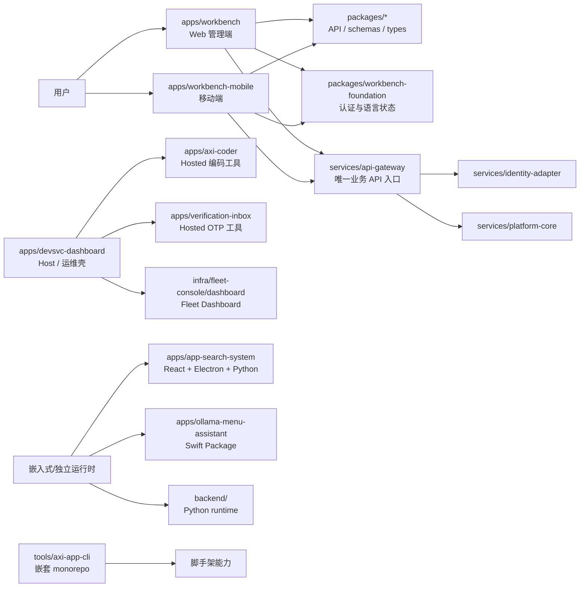

# Axi Workbench 源码架构总清单

> 状态：当前源码拓扑基线 · 更新：2026-08-08
>
> 这份清单回答“某个目录到底是什么、是否属于根 workspace、谁负责启动它”三个问题。它是物理源码与运行入口的导航，不替代六层控制面规则、服务契约或各子树 `AGENTS.md`。

## 先看结论

Axi Workbench 不是“七个相同类型的 App”，而是一个混合运行时项目：

1. **真正的用户工作台只有两个独立客户端**：`apps/workbench`（Web）和 `apps/workbench-mobile`（移动端）。它们共享认证、API 合同、语言偏好、设计令牌和 `@axi/workbench-foundation`，不共享页面与布局实现。
2. **`apps/devsvc-dashboard` 是 Host/运维壳**：它负责本地服务和可挂载应用的启动、展示与状态，不是第三个用户门户。
3. **`axi-coder`、`verification-inbox`、Fleet Console、App Search、Ollama Menu Assistant 是垂直工具或宿主子应用**，不能因为它们位于 `apps/` 或能被 Host 打开，就把它们都归类成同一套 Dashboard。
4. **根 `pnpm` workspace 只覆盖一部分源码**。`app-search-system`、`ollama-menu-assistant`、`infra/fleet-console/dashboard`、根 `backend/` 以及 `tools/axi-app-cli` 内部子包都有自己的运行/构建边界，不能用 `pnpm -r` 的结果代替完整源码清单。

## 拓扑总览



## 源码角色与入口

| 角色 | 路径 | 根 workspace | 主入口/启动事实 | 当前归类 |
|---|---|---:|---|---|
| Web 用户端 | `apps/workbench` | 是 | `apps/workbench/src/main.tsx`；`pnpm dev:workbench` | 唯一 Web 管理控制中心；Axi Dashboard Chrome、侧栏、标签、设置以及 C 级复杂管理/治理只属于这里 |
| 移动用户端 | `apps/workbench-mobile` | 是 | `apps/workbench-mobile/src/main.tsx`；`pnpm dev:mobile` | 唯一移动角色执行/辅助端；独立路由、顶栏、4 个常驻导航项、顶部 Scan 动作和面向 A/B 级任务的移动页面组合 |
| Host / 运维壳 | `apps/devsvc-dashboard` | 是 | `apps/devsvc-dashboard/src/main.tsx`；`pnpm dev:dashboard`；挂载表见 `config/axi-apps.json` | 本地服务管理和 Axi 应用 Host，不是第二用户门户 |
| Hosted 编码工具 | `apps/axi-coder` | 是 | `apps/axi-coder/src/main.tsx`；Tauri/Rust shell | 被 Host 挂载的开发工具，拥有自己的页面与原生边界 |
| Hosted OTP 工具 | `apps/verification-inbox` | 是 | `apps/verification-inbox/src/main.tsx`；真实邮箱能力由 Tauri/Python 边界承载 | 垂直工具，不承担工作台门户职责 |
| Fleet Dashboard | `infra/fleet-console/dashboard` | 否 | `src/main.tsx`；物理资源权威 CLI 是 `infra/fleet-console/scripts/fleetctl.py` | 物理服务层 Dashboard；由 Host 注册，但不属于 `apps/*` 根包集合 |
| App Search | `apps/app-search-system` | 否 | `frontend/src/index.tsx`、Electron control/display、`backend/server.py` | 保留在 Workbench 内的嵌入式多运行时垂直工具；有自己的内部 pnpm 包和构建编排 |
| macOS 菜单助手 | `apps/ollama-menu-assistant` | 否 | `Sources/OllamaMenuAssistant/MainApp.swift`；`Package.swift` | Swift 原生垂直工具，不是 Node Dashboard |
| 应用脚手架 CLI | `tools/axi-app-cli` | 仅根 wrapper | 顶层 `tools/axi-app-cli/AGENTS.md` / `README.md`；内部另有 workspace | 独立子 monorepo；工具链，不是业务 App |
| Python 运行时 | `backend/` | 否 | `backend/pyproject.toml`；mini-agent 相关入口 | 根仓库内嵌运行时，尚未纳入根 pnpm 生命周期；不与 `services/*` 混称 |

“根 workspace = 是”只表示该目录有可被根 `pnpm-workspace.yaml` 发现的 package manifest，不表示它是用户入口；“根 workspace = 否”也不表示代码已经废弃。

## 根 pnpm workspace 的实际边界

根 `pnpm-workspace.yaml` 声明 `apps/*`、`packages/*`、`services/*`、`ai/*`、`infra/*`、`tools/*`，但最终成员仍由各目录是否存在 package manifest 决定。当前可按下面的集合理解：

### 根 workspace 成员

- `apps/`：`axi-coder`、`devsvc-dashboard`、`verification-inbox`、`workbench`、`workbench-mobile`
- `packages/`：`api-client`、`epap-schemas-compat`、`schemas`、`types`、`ui`、`utils`、`workbench-foundation`
- `services/`：`api-gateway`、`auth-service`、`communication-gateway`、`control-plane`、`core-service`、`file-service`、`identity-adapter`、`notification-service`、`platform-core`、`workflow-engine`
- `ai/`：`agent-platform`、`knowledge-base`
- `tools/`：顶层 `axi-app-cli` wrapper

### 目录存在但不属于根 pnpm 成员

- `apps/app-search-system/`：内部 `frontend`、Electron control/display 和 Python backend 各自有运行边界；不能直接套用根 `pnpm --filter`。
- `apps/ollama-menu-assistant/`：Swift Package，使用 Swift 工具链。
- `infra/fleet-console/dashboard/`：嵌入 Fleet Console 的前端目录；Fleet 的机器/端口/进程事实由 Python `fleetctl` 管理。
- `backend/`：根 Python 运行时，使用 `pyproject.toml`，不在根 workspace 声明内。
- `packages/axi-rag/`：当前是源码目录，但没有根 package manifest；在完成 admission 和生命周期接入前，不应把它描述成已发布共享包。

### 不要混淆的嵌套边界

`tools/axi-app-cli/` 自己包含 `apps/*` 和 `packages/*` 的第二层 workspace。它是脚手架工具的内部依赖图，不是 Axi Workbench 业务应用的第二套门户。

## 共享层与迁移边界

| 层 | 当前权威入口 | 说明 |
|---|---|---|
| 用户端共享基础 | `packages/workbench-foundation/src/index.ts` | 只共享认证会话与语言偏好；不得导出页面或布局 |
| API/契约 | `packages/api-client`、`packages/schemas`、`packages/types` | Web、移动端和控制面通过合同接入，不通过互相导入页面实现 |
| 兼容出口 | `packages/epap-schemas-compat`、部分 `@epap/*` | 迁移兼容层，不代表旧命名空间是新功能的首选入口 |
| 旧 UI 出口 | `packages/ui` | `legacy`；目前仍被 Web 过渡使用，新 Dashboard 不应继续基于它扩展 |
| 生产业务 API | `services/api-gateway` → `identity-adapter` / `platform-core` | Go/Gin 生产链路；`auth-service` 与 Spring/H2 `core-service` 仅迁移兼容 |
| Host 注册 | `apps/devsvc-dashboard/config/axi-apps.json` | 决定哪些本地应用被 Host 发现、启动和挂载；不等同于 pnpm membership |

## 当前已知的“乱”从哪里来

1. 历史架构文档仍包含 `apps/web-portal`、`mobile-app`、`admin-dashboard` 等早期名称；物理源码和当前入口以本清单、根 `README.md`、子树 `AGENTS.md` 与 package manifest 为准。
2. `apps/` 同时承载用户端、Host、Hosted 子应用和垂直工具；目录层级是物理收纳，不是产品角色。
3. `@axi/*` 与 `@epap/*` 共存，以及 `packages/ui` legacy 与 shared `axi-ui` 共存，是迁移边界，不是两套可并行扩展的设计系统。
4. 根 workspace、Host 注册表、Swift/Electron/Python 内部构建系统分别描述不同事实；排查入口时必须先判断“我要查 workspace、启动器还是产品角色”。

App Search 已由现有 ownership decision 保留在本项目内；本轮不搬迁、不删除，只把它明确标成“嵌入式多运行时、根 workspace 外、生命周期待补齐”的对象。后续若要治理，应先补 manifest、启动/健康检查和 Host/工作区注册，再考虑代码拆分。

## 后续整理顺序

1. 以本清单为入口，补齐各非根成员的 manifest、启动 profile 和健康检查归属。
2. 再处理 `apps/app-search-system`、Fleet Dashboard、根 `backend/` 的生命周期与文档漂移；不通过移动目录制造“看起来整齐”的假解决方案。
3. 在消费者验证覆盖后，逐步收敛 `@epap/*` / `packages/ui` 兼容层；Web 与移动端页面仍保持独立。
4. 任何新增用户入口先证明它不是 Web/mobile/Host 的重复实现，并同步本清单、对应 `AGENTS.md`、manifest 和验证命令。

## 新人/Agent 阅读顺序

```text
AGENTS.md
  -> README.md + INDEX.md
  -> docs/architecture/source-catalog.md（本文件）
  -> 目标子树 AGENTS.md
  -> 目标目录 package.json / pyproject.toml / Package.swift / Host registry
  -> 对应的最小验证命令
```

本文件只在源码角色、根 workspace membership、主入口或 Host 注册发生变化时更新；业务实现细节仍归各目录的源码、测试和契约文档负责。
