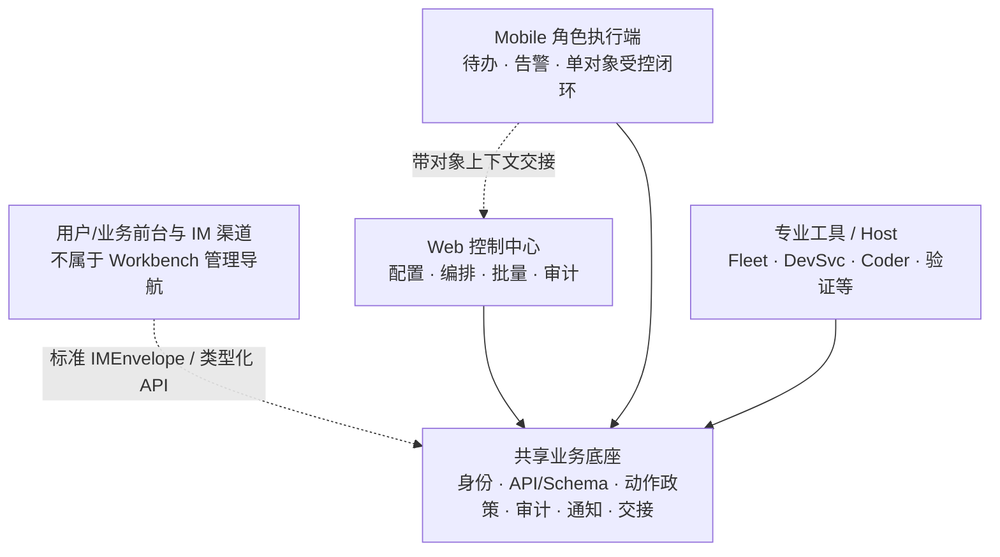

# 多端后台产品架构定位 — 设计

## 设计命题

多端不是“一套后台，两个断点”，而是“**一套领域事实与动作合同，三类角色化工作表面**”。公开案例显示，消费者/商家/运营者/专业伙伴会使用不同的产品表面；即便同一商家同时有 Web 和 App，也会按任务时机和权限拆分，而不是复刻页面。

## 表面与动作分工

| 动作等级 | 表面 | 判断标准 | 示例 |
| --- | --- | --- | --- |
| A：观察与提醒 | Web / Mobile / 专业工具 | 不改写领域事实，范围随角色而变 | 摘要、告警、责任范围状态。 |
| B：受控单对象执行 | Web；符合动作政策时的 Mobile | 对象、责任和影响都清晰，可服务端重验与审计 | 单项待办回执、受控审批确认、Mobile 审批扫码。 |
| C：管理与治理 | Web | 跨对象、批量、组织级或需桌面分析/复盘 | RBAC、全局设置、工作流编排、审计导出。 |
| D：专业/物理操作 | 具体专业执行工具 | 依赖专用设备、进程、开发或物理服务上下文 | Fleet 等实际运维操作、专项编码或验证；DevSvc 只提供 Host/发现入口。 |

这也修正了“高风险动作一定不能出现在手机上”的过度规则：真正的门槛是动作政策能否明确对象、范围、授权、重验、确认和审计。若不能满足，就回到 Web 或专业工具。

## 设计约束

1. Web 与 Mobile 保持独立入口、路由、页面和布局；仅共享认证会话、API/Schema、语言偏好与 design tokens。
2. 每项能力必须有动作政策：角色、动作等级、允许表面、服务端状态/授权、确认、幂等、审计、交接与失败回退。
3. Web 不提供通用扫码；Mobile 顶部 Scan 是“已授权审批确认”，Identity 网页登录确认是独立登录流程。两条扫码流程不得共用模糊命名、默认权限或验收断言。
4. Mobile 的 Home / Projects / Workspace / Me 是四个常驻导航项；Scan 是顶部动作，不是第五项底栏。
5. Host/专业工具可被发现和审计，但不进入用户后台的一级信息架构；Host 不能代替实际执行工具成为 D 级动作 Owner，D 级操作不复制为通用按钮。
6. 实施先完成能力台账和动作政策，再做页面；禁止以目录迁移、响应式分支或功能平铺制造“统一”。

## 文档落点

- `MARKET-REFERENCE.md`：公开案例、来源、可迁移推导和排除边界。
- `DESKTOP-WORKBENCH-RESEARCH.md`：桌面工作台公开案例复核、实际 Web 信息架构和通用扫码排除项。
- `docs/state/PRD.md`：用户可读的产品架构、需求、路线图和风险。
- `CAPABILITY-OWNERSHIP.md`：后续每项能力必须复用的归属与动作政策字段。
- `docs/state/TDD.md`：新的 REQ-* 验证矩阵。
- `docs/state/TODO.md` / `docs/state/MILESTONE.md`：实施顺序、出口和证据。
- `docs/project-docs.manifest.json` → `docs/HANDOFF.md`：向零上下文接手者暴露本次决策。
